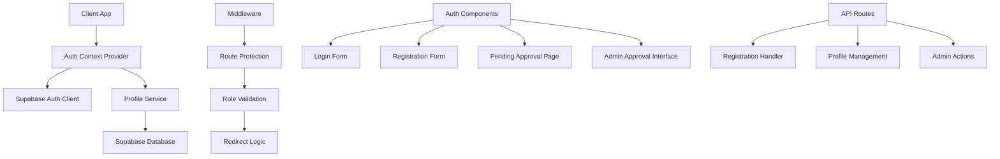
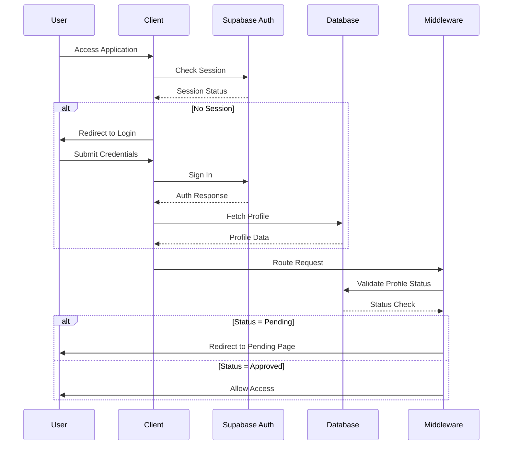

# Design Document

## Overview

The authentication system overhaul will completely remove the existing problematic authentication code and implement a clean, secure authentication system from scratch. The design preserves the existing database schema while building new authentication components, middleware, and utilities that properly integrate with Supabase Auth and the existing user profiles system.

## Architecture

### High-Level Architecture



### Authentication Flow



## Components and Interfaces

### 1. Authentication Context (`lib/auth-new.tsx`)

**Purpose**: Centralized authentication state management with clean separation of concerns.

**Key Features**:
- Simplified state management without complex fallbacks
- Proper error handling and loading states
- Integration with existing database schema
- Role-based access control integration

**Interface**:
```typescript
interface AuthContextType {
  // Core authentication state
  user: User | null
  userProfile: UserProfile | null
  loading: boolean
  
  // Authentication actions
  signIn: (data: LoginData) => Promise<void>
  signUp: (data: RegistrationData) => Promise<void>
  signOut: () => Promise<void>
  refreshProfile: () => Promise<void>
  
  // Status helpers
  isAuthenticated: boolean
  isApproved: boolean
  isPending: boolean
  
  // Role-based access
  hasRole: (role: UserRole) => boolean
  hasAnyRole: (roles: UserRole[]) => boolean
  canAccessAdminFeatures: boolean
}
```

### 2. Middleware (`middleware-new.ts`)

**Purpose**: Server-side route protection with proper session validation.

**Key Features**:
- Secure server-side session validation
- Role-based route protection
- Proper redirect handling
- Error recovery and logging

**Protection Logic**:
- Public routes: Allow unrestricted access
- Protected routes: Require valid session and approved status
- Admin routes: Require admin/in-house roles
- API routes: Validate authentication for sensitive operations

### 3. Authentication Components

#### Login Form (`components/auth/login-form-new.tsx`)
- Clean form validation using react-hook-form
- Proper error handling and user feedback
- Integration with Supabase Auth
- Redirect handling for post-login navigation

#### Registration Form (`components/auth/registration-form-new.tsx`)
- Multi-step validation for user data
- Terms of service agreement
- Profile creation integration
- Pending status handling

#### Pending Approval Page (`components/auth/pending-approval-new.tsx`)
- Clear status messaging
- Contact information for support
- Automatic refresh on status change
- Logout functionality

#### Admin Approval Interface (`components/auth/admin-approval-new.tsx`)
- Bulk user approval functionality
- User information display
- Search and filter capabilities
- Email notification integration

### 4. Protected Route Component (`components/auth/protected-route-new.tsx`)

**Purpose**: Client-side route protection with role validation.

**Key Features**:
- Declarative route protection
- Role-based access control
- Proper loading states
- Redirect handling

## Data Models

### Existing Database Schema Integration

The design works with the existing database schema:

#### Profiles Table (Existing)
```sql
-- Using existing profiles table structure
profiles {
  id: UUID (references auth.users.id)
  full_name: String
  email: String
  phone: String?
  city: String?
  state: String?
  status: user_status (pending, approved, rejected)
  role: system_role (admin, in_house, supervisor, tlc, escort)
  created_at: DateTime
  updated_at: DateTime
}
```

#### User Status Enum (Existing)
- `pending`: Awaiting admin approval
- `approved`: Active user with full access
- `rejected`: Denied access (future use)

#### System Role Enum (Existing)
- `admin`: Full system access
- `in_house`: System manager with configurable permissions
- `supervisor`: On-site manager with day rate tracking
- `tlc`: Talent logistics coordinator
- `escort`: On-ground operator with hourly tracking

### Profile Service Integration

**Purpose**: Clean interface for profile operations that work with existing schema.

```typescript
interface ProfileService {
  createProfile(userId: string, data: RegistrationData): Promise<UserProfile>
  getProfile(userId: string): Promise<UserProfile | null>
  updateProfileStatus(userId: string, status: UserStatus): Promise<void>
  getPendingUsers(): Promise<UserProfile[]>
  approveUsers(userIds: string[]): Promise<void>
}
```

## Error Handling

### Authentication Errors

**Client-Side Error Handling**:
- Network errors: Retry logic with exponential backoff
- Validation errors: Real-time form feedback
- Authentication failures: Clear user messaging
- Session expiry: Automatic redirect to login

**Server-Side Error Handling**:
- Database connection issues: Graceful degradation
- Profile fetch failures: Fallback to basic user info
- Role validation errors: Secure error logging
- Rate limiting: Proper HTTP status codes

### Error Recovery Strategies

1. **Session Recovery**: Automatic token refresh before expiry
2. **Profile Recovery**: Retry profile fetch with fallback
3. **Network Recovery**: Offline detection and retry logic
4. **State Recovery**: Persist auth state across page refreshes

## Testing Strategy

### Unit Tests

**Authentication Context Tests**:
- State management logic
- Authentication flow handling
- Error state management
- Role-based access control

**Component Tests**:
- Form validation and submission
- Error display and handling
- Loading state management
- User interaction flows

### Integration Tests

**Authentication Flow Tests**:
- Complete login/logout cycles
- Registration and approval workflows
- Role-based access scenarios
- Session management and refresh

**Database Integration Tests**:
- Profile creation and updates
- Status change workflows
- Role assignment validation
- Data consistency checks

### End-to-End Tests

**User Journey Tests**:
- New user registration flow
- Admin approval workflow
- Role-based navigation
- Session persistence across browser restarts

**Security Tests**:
- Unauthorized access attempts
- Session hijacking prevention
- Role escalation prevention
- Data exposure validation

## Security Considerations

### Authentication Security

**Password Security**:
- Supabase handles password hashing and validation
- Minimum password requirements enforced
- Rate limiting on login attempts
- Account lockout after failed attempts

**Session Security**:
- HTTP-only cookies for session tokens
- Secure token transmission over HTTPS
- Automatic session expiry and refresh
- Cross-site request forgery (CSRF) protection

### Authorization Security

**Role-Based Access Control**:
- Server-side role validation
- Principle of least privilege
- Role assignment audit trail
- Regular access review processes

**Data Protection**:
- Row-level security (RLS) policies
- Encrypted data transmission
- PII protection compliance
- Audit logging for sensitive operations

## Implementation Phases

### Phase 1: Cleanup and Preparation
1. Remove existing authentication components
2. Remove problematic middleware and API routes
3. Clean up unused dependencies
4. Audit existing database schema
5. Create backup of current system state

### Phase 2: Core Authentication
1. Implement new authentication context
2. Create basic login/logout functionality
3. Implement session management
4. Add error handling and recovery

### Phase 3: User Management
1. Implement registration flow
2. Create profile management service
3. Add pending approval system
4. Implement admin approval interface

### Phase 4: Route Protection
1. Implement new middleware
2. Create protected route component
3. Add role-based access control
4. Implement redirect logic

### Phase 5: Testing and Validation
1. Add comprehensive test coverage
2. Perform security audit
3. Load testing and performance optimization
4. User acceptance testing

### Phase 6: Deployment and Monitoring
1. Gradual rollout with feature flags
2. Monitor authentication metrics
3. Error tracking and alerting
4. Performance monitoring and optimization

## Supabase Configuration Requirements

### Authentication Settings

**Email Configuration**:
```sql
-- Enable email/password authentication
UPDATE auth.config SET 
  enable_signup = true,
  enable_email_confirmations = false, -- Disable for internal app
  enable_phone_confirmations = false;
```

**Security Settings**:
```sql
-- Configure session settings
UPDATE auth.config SET
  jwt_expiry = 3600, -- 1 hour
  refresh_token_rotation_enabled = true,
  security_update_password_require_reauthentication = true;
```

### Row Level Security Policies

**Profiles Table Policies**:
```sql
-- Users can read their own profile
CREATE POLICY "Users can view own profile" ON profiles
  FOR SELECT USING (auth.uid() = id);

-- Users can update their own profile (limited fields)
CREATE POLICY "Users can update own profile" ON profiles
  FOR UPDATE USING (auth.uid() = id);

-- Admins can view all profiles
CREATE POLICY "Admins can view all profiles" ON profiles
  FOR SELECT USING (
    EXISTS (
      SELECT 1 FROM profiles 
      WHERE id = auth.uid() 
      AND role IN ('admin', 'in_house')
    )
  );

-- Admins can update user status
CREATE POLICY "Admins can update user status" ON profiles
  FOR UPDATE USING (
    EXISTS (
      SELECT 1 FROM profiles 
      WHERE id = auth.uid() 
      AND role IN ('admin', 'in_house')
    )
  );
```

### Database Functions

**Profile Creation Function**:
```sql
CREATE OR REPLACE FUNCTION create_user_profile(
  user_id UUID,
  user_email TEXT,
  full_name TEXT,
  phone TEXT DEFAULT NULL,
  city TEXT DEFAULT NULL,
  state TEXT DEFAULT NULL
)
RETURNS JSON
LANGUAGE plpgsql
SECURITY DEFINER
AS $$
BEGIN
  INSERT INTO profiles (
    id, full_name, email, phone, city, state, status, created_at, updated_at
  ) VALUES (
    user_id, full_name, user_email, phone, city, state, 'pending', NOW(), NOW()
  );
  
  RETURN json_build_object('success', true);
EXCEPTION
  WHEN OTHERS THEN
    RETURN json_build_object('success', false, 'error', SQLERRM);
END;
$$;
```

## Migration Strategy

### Code Migration Steps

1. **Backup Current System**: Create git branch with current state
2. **Remove Old Code**: Systematically remove existing auth components
3. **Implement New System**: Build new authentication system incrementally
4. **Test Integration**: Validate with existing database schema
5. **Deploy Gradually**: Use feature flags for controlled rollout

### Database Migration Requirements

**No Schema Changes Required**: The existing database schema is compatible with the new authentication system. Only RLS policies may need updates.

**Potential Policy Updates**:
- Review existing RLS policies for security gaps
- Add policies for new authentication patterns
- Ensure proper admin access controls
- Validate profile creation permissions

### Rollback Strategy

**Code Rollback**: Git branch allows immediate rollback to previous state
**Database Rollback**: No schema changes mean no database rollback needed
**Configuration Rollback**: Document all Supabase configuration changes for easy reversal

This design provides a comprehensive foundation for implementing a clean, secure authentication system while preserving your existing database structure and user data.