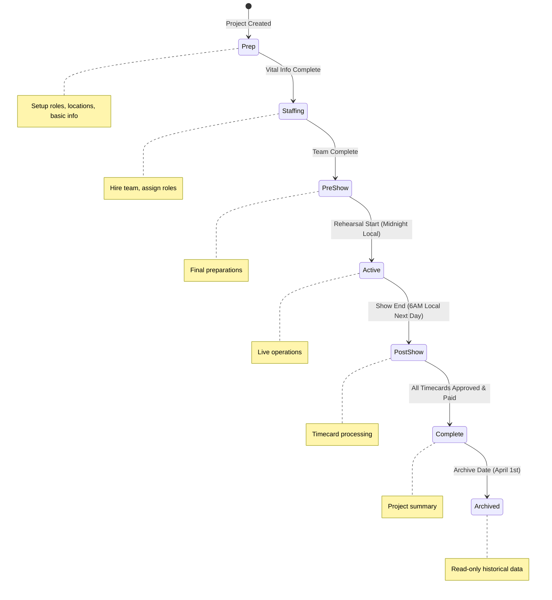

# Design Document

## Overview

The Project Lifecycle Management system replaces the binary "activate project" concept with a comprehensive phase-based approach that automatically tracks and transitions projects through their natural lifecycle. The system uses timezone-aware date calculations, completion criteria validation, and configurable transition rules to provide accurate project status tracking and phase-appropriate functionality.

## Architecture

### Core Components

1. **Phase Engine**: Central service managing phase transitions and validation
2. **Timezone Service**: Handles timezone-aware date calculations and transitions
3. **Criteria Validator**: Evaluates completion requirements for each phase
4. **Action Items Generator**: Creates phase-appropriate task lists
5. **Transition Logger**: Tracks all phase changes with audit trail
6. **Configuration Manager**: Handles system and project-level settings

### Phase State Machine



## Components and Interfaces

### Phase Engine Service

```typescript
interface PhaseEngine {
  getCurrentPhase(projectId: string): Promise<ProjectPhase>
  evaluateTransition(projectId: string): Promise<TransitionResult>
  executeTransition(projectId: string, targetPhase: ProjectPhase, trigger: TransitionTrigger): Promise<void>
  scheduleAutomaticTransitions(projectId: string): Promise<void>
  getPhaseActionItems(projectId: string, phase: ProjectPhase): Promise<ActionItem[]>
}

// Leverage existing project_status enum with new values
enum ProjectPhase {
  PREP = 'prep',
  STAFFING = 'staffing', 
  PRE_SHOW = 'pre_show',
  ACTIVE = 'active',
  POST_SHOW = 'post_show',
  COMPLETE = 'complete',
  ARCHIVED = 'archived'
}

interface TransitionResult {
  canTransition: boolean
  targetPhase: ProjectPhase | null
  blockers: string[]
  scheduledAt?: Date
}
```

### Timezone Service

```typescript
interface TimezoneService {
  getProjectTimezone(projectId: string): Promise<string>
  calculateTransitionTime(date: Date, time: string, timezone: string): Promise<Date>
  isTransitionDue(scheduledTime: Date): boolean
  handleDaylightSaving(date: Date, timezone: string): Date
}
```

### Criteria Validator

```typescript
interface CriteriaValidator {
  validatePrepCompletion(projectId: string): Promise<ValidationResult>
  validateStaffingCompletion(projectId: string): Promise<ValidationResult>
  validatePreShowReadiness(projectId: string): Promise<ValidationResult>
  validateTimecardCompletion(projectId: string): Promise<ValidationResult>
}

interface ValidationResult {
  isComplete: boolean
  completedItems: string[]
  pendingItems: string[]
  blockers: string[]
}
```

## Data Models

### Project Phase Tracking

```sql
-- Extend existing project_status enum
ALTER TYPE project_status ADD VALUE 'staffing';
ALTER TYPE project_status ADD VALUE 'pre_show'; 
ALTER TYPE project_status ADD VALUE 'post_show';
ALTER TYPE project_status ADD VALUE 'complete';
ALTER TYPE project_status ADD VALUE 'archived';

-- Extend projects table (leverages existing status column)
ALTER TABLE projects ADD COLUMN phase_updated_at TIMESTAMP WITH TIME ZONE DEFAULT NOW();
ALTER TABLE projects ADD COLUMN auto_transitions_enabled BOOLEAN DEFAULT true;
ALTER TABLE projects ADD COLUMN timezone VARCHAR(50);
ALTER TABLE projects ADD COLUMN rehearsal_start_date DATE;
ALTER TABLE projects ADD COLUMN show_end_date DATE;

-- Use existing project_audit_log for phase transitions
-- No new tables needed - just add entries with action_type = 'phase_transition'
```

### Configuration Integration

```sql
-- Add phase configuration to existing project_settings table
ALTER TABLE project_settings ADD COLUMN auto_transitions_enabled BOOLEAN DEFAULT true;
ALTER TABLE project_settings ADD COLUMN archive_month INTEGER DEFAULT 4;
ALTER TABLE project_settings ADD COLUMN archive_day INTEGER DEFAULT 1;
ALTER TABLE project_settings ADD COLUMN post_show_transition_hour INTEGER DEFAULT 6;
```

### Action Items Enhancement

```sql
-- Leverage existing project_readiness table for action items
-- No schema changes needed - use existing readiness data to generate phase-appropriate actions
-- Action items will be calculated dynamically based on current phase and readiness status
```

## Error Handling

### Transition Failures

1. **Timezone Calculation Errors**: Fall back to UTC with warning log
2. **Criteria Validation Failures**: Block transition and show specific blockers
3. **Database Transaction Failures**: Rollback and retry with exponential backoff
4. **Scheduled Transition Misses**: Execute immediately with late execution flag

### Edge Cases

1. **Project Date Changes**: Recalculate all scheduled transitions
2. **Timezone Changes**: Update all future scheduled transitions
3. **Manual Override Conflicts**: Administrator confirmation required
4. **System Clock Issues**: Use database timestamps as source of truth

## Testing Strategy

### Unit Tests

- Phase transition logic validation
- Timezone calculation accuracy
- Criteria validation functions
- Action item generation

### Integration Tests

- End-to-end phase progression
- Automatic transition scheduling
- Manual override workflows
- Cross-timezone project handling

### Performance Tests

- Bulk transition processing
- Large project dataset handling
- Real-time phase monitoring
- Database query optimization

## Implementation Phases

### Phase 1: Core Infrastructure
- Database schema updates
- Phase engine service
- Basic transition logic
- Configuration management

### Phase 2: Automatic Transitions
- Timezone service implementation
- Scheduled transition system
- Criteria validation framework
- Transition logging

### Phase 3: UI Integration
- Phase display components
- Action items enhancement
- Mode toggle replacement
- Admin configuration interface

### Phase 4: Advanced Features
- Manual override system
- Bulk project management
- Reporting and analytics
- Performance optimization

## Security Considerations

### Access Control
- Phase transitions require appropriate permissions
- Manual overrides restricted to administrators
- Audit trail for all phase changes
- Configuration changes require elevated privileges

### Data Integrity
- Atomic phase transitions with rollback capability
- Validation of all transition criteria before execution
- Immutable transition history
- Backup and recovery procedures for phase data

## Performance Optimization

### Caching Strategy
- Cache current phase for active projects
- Precompute transition schedules
- Cache validation results with TTL
- Optimize database queries with proper indexing

### Background Processing
- Scheduled transition evaluation via cron jobs
- Async criteria validation for large projects
- Batch processing for bulk operations
- Queue system for transition notifications