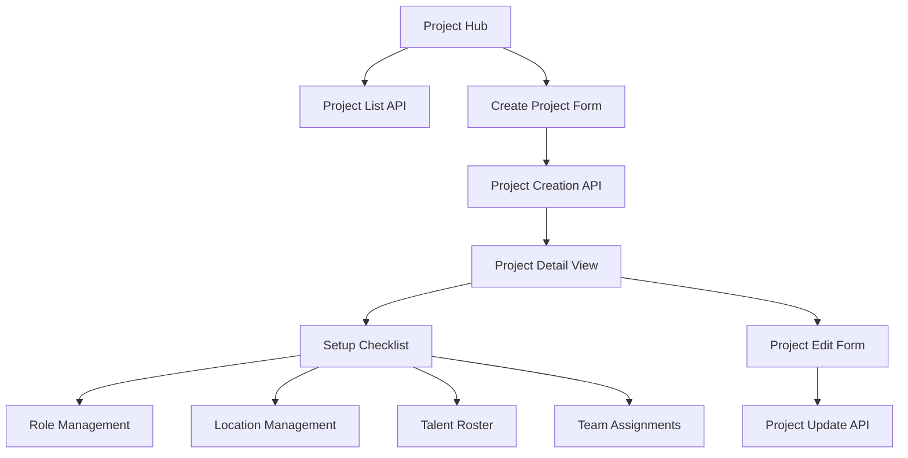

# Design Document

## Overview

The Project Management system serves as the foundational module for the Talent Tracker application, enabling comprehensive project lifecycle management from creation through activation and archival. The system implements a role-based access control model where project visibility and functionality are determined by user roles and project status. The design emphasizes a mobile-first approach with seamless desktop adaptation, following the established PWA architecture patterns.

## Architecture

### System Components

The project management system consists of several interconnected components:

1. **Project Hub**: Central dashboard for project listing and navigation
2. **Project Creation Flow**: Streamlined project setup with minimal required fields
3. **Project Detail View**: Comprehensive project management interface
4. **Project Setup Checklist**: Guided activation workflow
5. **Role-Based Access Control**: Dynamic UI based on user permissions
6. **Project Status Management**: Lifecycle state transitions

### Data Flow Architecture



### Integration Points

- **Authentication System**: Leverages existing Supabase Auth for user context
- **Role Management**: Integrates with existing role-based access control
- **Navigation System**: Extends current mobile/desktop navigation patterns
- **Database Layer**: Utilizes Prisma ORM with Supabase PostgreSQL
- **Notification System**: Hooks into existing notification infrastructure

## Components and Interfaces

### Core Components

#### ProjectHub Component
```typescript
interface ProjectHubProps {
  userRole: ProjectRole;
  projects: Project[];
  onCreateProject: () => void;
}
```

**Responsibilities:**
- Display role-filtered project list
- Handle project creation initiation
- Manage project status indicators
- Provide search and filtering capabilities

#### ProjectCard Component
```typescript
interface ProjectCardProps {
  project: Project;
  userRole: ProjectRole;
  canAccessDetails: boolean;
  hasTimecards: boolean;
  onViewTimecard?: () => void;
}
```

**Responsibilities:**
- Display project summary information
- Show appropriate action buttons based on role and project status
- Handle navigation to project details or timecard view

#### ProjectDetailView Component
```typescript
interface ProjectDetailViewProps {
  project: Project;
  userRole: ProjectRole;
  onEdit: (project: Project) => void;
  onActivate: () => void;
  onArchive: () => void;
}
```

**Responsibilities:**
- Display comprehensive project information
- Manage setup checklist state
- Handle project lifecycle actions
- Coordinate with sub-components for roles, locations, etc.

#### ProjectForm Component
```typescript
interface ProjectFormProps {
  mode: 'create' | 'edit';
  initialData?: Partial<Project>;
  onSubmit: (data: ProjectFormData) => void;
  onCancel: () => void;
}
```

**Responsibilities:**
- Handle project creation and editing forms
- Validate form inputs
- Manage form state and submission

### API Interfaces

#### Project Service
```typescript
interface ProjectService {
  getProjects(userId: string): Promise<Project[]>;
  createProject(data: CreateProjectData): Promise<Project>;
  updateProject(id: string, data: UpdateProjectData): Promise<Project>;
  activateProject(id: string): Promise<void>;
  archiveProject(id: string): Promise<void>;
  getProjectDetails(id: string): Promise<ProjectDetails>;
}
```

#### Project API Routes
- `GET /api/projects` - List projects for current user
- `POST /api/projects` - Create new project
- `GET /api/projects/[id]` - Get project details
- `PUT /api/projects/[id]` - Update project
- `POST /api/projects/[id]/activate` - Activate project
- `POST /api/projects/[id]/archive` - Archive project

## Data Models

### Core Project Model
```typescript
interface Project {
  id: string;
  name: string;
  description?: string;
  productionCompany?: string;
  hiringContact?: string;
  projectLocation?: string;
  startDate: Date;
  endDate: Date;
  status: 'prep' | 'active' | 'archived';
  createdAt: Date;
  updatedAt: Date;
  createdBy: string;
}
```

### Project Setup Checklist
```typescript
interface ProjectSetupChecklist {
  projectId: string;
  rolesAndPayCompleted: boolean;
  talentRosterCompleted: boolean;
  teamAssignmentsCompleted: boolean;
  locationsCompleted: boolean;
  completedAt?: Date;
}
```

### Project Role Configuration
```typescript
interface ProjectRole {
  id: string;
  projectId: string;
  roleName: 'admin' | 'in-house' | 'supervisor' | 'talent-logistics-coordinator' | 'escort';
  basePayRate?: number;
  isActive: boolean;
}
```
DOUBLE CHECK WITH DATABASE

### Project Location
```typescript
interface ProjectLocation {
  id: string;
  projectId: string;
  name: string;
  isDefault: boolean;
  sortOrder: number;
}
```

### Database Schema Extensions

The project management system requires several new tables and modifications to existing ones:

```sql
-- Projects table
CREATE TABLE projects (
  id UUID PRIMARY KEY DEFAULT gen_random_uuid(),
  name VARCHAR(255) NOT NULL,
  description TEXT,
  production_company VARCHAR(255),
  hiring_contact VARCHAR(255),
  project_location VARCHAR(255),
  start_date DATE NOT NULL,
  end_date DATE NOT NULL,
  status VARCHAR(20) DEFAULT 'prep' CHECK (status IN ('prep', 'active', 'archived')),
  created_at TIMESTAMP WITH TIME ZONE DEFAULT NOW(),
  updated_at TIMESTAMP WITH TIME ZONE DEFAULT NOW(),
  created_by UUID REFERENCES users(id)
);

-- Project setup checklist
CREATE TABLE project_setup_checklist (
  project_id UUID PRIMARY KEY REFERENCES projects(id),
  roles_and_pay_completed BOOLEAN DEFAULT FALSE,
  talent_roster_completed BOOLEAN DEFAULT FALSE,
  team_assignments_completed BOOLEAN DEFAULT FALSE,
  locations_completed BOOLEAN DEFAULT FALSE,
  completed_at TIMESTAMP WITH TIME ZONE
);

-- Project roles configuration
CREATE TABLE project_roles (
  id UUID PRIMARY KEY DEFAULT gen_random_uuid(),
  project_id UUID REFERENCES projects(id),
  role_name VARCHAR(50) NOT NULL,
  base_pay_rate DECIMAL(10,2),
  is_active BOOLEAN DEFAULT TRUE,
  created_at TIMESTAMP WITH TIME ZONE DEFAULT NOW()
);

-- Project locations
CREATE TABLE project_locations (
  id UUID PRIMARY KEY DEFAULT gen_random_uuid(),
  project_id UUID REFERENCES projects(id),
  name VARCHAR(100) NOT NULL,
  is_default BOOLEAN DEFAULT FALSE,
  sort_order INTEGER DEFAULT 0,
  created_at TIMESTAMP WITH TIME ZONE DEFAULT NOW()
);
```

## Error Handling

### Validation Rules

#### Project Creation
- Project name: Required, 1-255 characters
- Start date: Required, cannot be in the past
- End date: Required, must be after start date
- Optional fields: No validation beyond length limits

#### Project Updates
- Same validation as creation
- Additional check: Cannot change dates if project has active timecards
- Status transitions: Only allow prep → active → archived

#### Access Control
- Users can only see projects they're assigned to
- Role-based feature access within projects
- Inactive project restrictions for non-admin roles

### Error Response Format
```typescript
interface ApiError {
  error: string;
  code: string;
  details?: Record<string, string>;
}
```

### Common Error Scenarios
- **Unauthorized Access**: User attempts to access project they're not assigned to
- **Invalid Status Transition**: Attempting to activate project without completing checklist
- **Validation Failures**: Form submission with invalid data
- **Concurrent Modifications**: Handling simultaneous edits by multiple users

## Testing Strategy

### Unit Testing
- **Component Tests**: Verify UI components render correctly with different props
- **Service Tests**: Test API service methods with mocked responses
- **Validation Tests**: Ensure form validation rules work correctly
- **Utility Tests**: Test helper functions for date validation, role checking, etc.

### Integration Testing
- **API Route Tests**: Test all project API endpoints with various scenarios
- **Database Tests**: Verify database operations and constraints
- **Authentication Tests**: Ensure proper role-based access control
- **Form Submission Tests**: End-to-end form validation and submission

### End-to-End Testing
- **Project Creation Flow**: Complete project creation from start to finish
- **Setup Checklist Workflow**: Test the entire project activation process
- **Role-Based Access**: Verify different user roles see appropriate interfaces
- **Project Lifecycle**: Test transitions from prep to active to archived

### Test Data Setup
```typescript
// Test project factory
const createTestProject = (overrides?: Partial<Project>): Project => ({
  id: 'test-project-1',
  name: 'Test Production',
  startDate: new Date('2024-01-01'),
  endDate: new Date('2024-01-31'),
  status: 'prep',
  createdAt: new Date(),
  updatedAt: new Date(),
  createdBy: 'test-user-1',
  ...overrides
});
```

### Performance Considerations

#### Optimization Strategies
- **Lazy Loading**: Load project details only when needed
- **Caching**: Cache project lists and frequently accessed data
- **Pagination**: Implement pagination for large project lists
- **Optimistic Updates**: Update UI immediately for better user experience

#### Database Optimization
- **Indexing**: Create indexes on frequently queried fields (user_id, project_id, status)
- **Query Optimization**: Use efficient joins and avoid N+1 queries
- **Connection Pooling**: Leverage Supabase connection pooling for scalability

## Security Considerations

### Row Level Security (RLS)
```sql
-- Projects RLS policy
CREATE POLICY project_access ON projects
  FOR ALL USING (
    id IN (
      SELECT project_id FROM user_project_assignments 
      WHERE user_id = auth.uid()
    )
  );
```

### Data Protection
- **Input Sanitization**: Sanitize all user inputs to prevent XSS
- **SQL Injection Prevention**: Use parameterized queries via Prisma
- **Access Control**: Enforce role-based permissions at API level
- **Audit Logging**: Track all project modifications for compliance

### Privacy Compliance
- **Data Minimization**: Only collect necessary project information
- **Retention Policies**: Implement data retention rules for archived projects
- **User Consent**: Ensure proper consent for data collection and processing

## Enhanced Project Details Page Design

### Overview

The project details page has been redesigned as a comprehensive project management hub with two distinct modes based on project status. This design follows the wireframe specification in `project-details-wireframe.md` and provides a complete interface for managing all aspects of a project.

### Layout Architecture

#### Mode-Based Interface
The page dynamically switches between two modes:
- **Setup Mode** (Prep Status): Tabbed interface for project configuration
- **Operations Mode** (Active Status): Dashboard interface for live project management

#### Component Hierarchy
```
ProjectDetailLayout
├── ProjectHeader (sticky)
├── ProjectOverviewCard (always visible)
└── ConditionalContent
    ├── ProjectTabs (prep status)
    │   ├── InfoTab
    │   ├── RolesTeamTab
    │   ├── TalentRosterTab
    │   ├── AssignmentsTab
    │   └── SettingsTab
    └── OperationsDashboard (active status)
        ├── LiveKPIsSection
        ├── TalentLocationsBoard
        └── TeamStatusBoard
```

### Enhanced Data Models

#### Extended Project Model
```typescript
interface EnhancedProject extends Project {
  talentExpected?: number;
  description?: string;
  statistics: ProjectStatistics;
  setupChecklist: ProjectSetupChecklist;
}

interface ProjectStatistics {
  talentExpected: number;
  talentAssigned: number;
  staffNeeded: number;
  staffAssigned: number;
  staffCheckedIn: number;
  talentPresent: number;
  activeEscorts: number;
  staffOvertime: {
    over8Hours: number;
    over12Hours: number;
  };
}
```

#### Location Management
```typescript
interface ProjectLocation {
  id: string;
  projectId: string;
  name: string;
  abbreviation: string;
  color: string;
  isDefault: boolean;
  sortOrder: number;
}
```

#### Team Assignment
```typescript
interface TeamAssignment {
  id: string;
  projectId: string;
  userId: string;
  roleId: string;
  payRateOverride?: number;
  shiftOverride?: string;
  isActive: boolean;
}
```

#### Talent Assignment
```typescript
interface TalentAssignment {
  id: string;
  projectId: string;
  talentId: string;
  escortId?: string;
  status: 'assigned' | 'unassigned' | 'present' | 'not_arrived';
  currentLocationId?: string;
}
```

### Component Specifications

#### ProjectHeader Component
```typescript
interface ProjectHeaderProps {
  project: EnhancedProject;
  onEdit: () => void;
}
```
- Sticky positioning at top of page
- Displays project title, status badge, and edit action
- Responsive design for mobile and desktop

#### ProjectOverviewCard Component
```typescript
interface ProjectOverviewCardProps {
  project: EnhancedProject;
  onActivate?: () => void;
}
```
- Always visible below header
- Shows project statistics and setup checklist (prep only)
- Displays "Set Project to Active" button when checklist complete

#### ProjectTabs Component
```typescript
interface ProjectTabsProps {
  project: EnhancedProject;
  activeTab: string;
  onTabChange: (tab: string) => void;
}
```
- Only visible for prep status projects
- Manages tab state and content switching
- Integrates with setup checklist completion

#### InfoTab Component
```typescript
interface InfoTabProps {
  project: EnhancedProject;
  onUpdateDescription: (description: string) => void;
  onLocationUpdate: () => void;
}
```
- Editable project description
- Location management interface
- Default location creation and custom location management

#### RolesTeamTab Component
```typescript
interface RolesTeamTabProps {
  project: EnhancedProject;
  roles: ProjectRole[];
  staff: User[];
  assignments: TeamAssignment[];
  onRoleUpdate: (role: ProjectRole) => void;
  onAssignmentUpdate: (assignment: TeamAssignment) => void;
}

interface StaffFilter {
  search: string;
  role: string | null;
  location: string | null;
  status: string | null;
  experience: string | null;
}
```
- Role definition table with corrected pay rates and time types:
  - Supervisor: $300/day (Daily rate)
  - Coordinator: $350/day (Daily rate)
  - Escort: $20/hr (Hourly rate)  
- Filterable staff list with multiple simultaneous filters
- Bulk selection and assignment capabilities
- Assignment summary with cost calculations
- Inline pay rate overrides and schedule notes

#### OperationsDashboard Component
```typescript
interface OperationsDashboardProps {
  project: EnhancedProject;
  liveData: LiveProjectData;
  onLocationUpdate: (talentId: string, locationId: string) => void;
  onCheckout: (userIds: string[]) => void;
}

interface LiveProjectData {
  talentLocations: TalentLocationStatus[];
  teamStatus: TeamMemberStatus[];
  kpis: ProjectStatistics;
}
```
- Real-time project monitoring
- Live KPIs with color-coded alerts
- Talent location tracking with quick actions
- Team status with checkout controls

### API Extensions

#### New Endpoints
```typescript
// Project statistics
GET /api/projects/[id]/statistics
Response: ProjectStatistics

// Location management
GET /api/projects/[id]/locations
POST /api/projects/[id]/locations
PUT /api/projects/[id]/locations/[locationId]
DELETE /api/projects/[id]/locations/[locationId]

// Team assignments
GET /api/projects/[id]/team-assignments
POST /api/projects/[id]/team-assignments
PUT /api/projects/[id]/team-assignments/[assignmentId]

// Talent assignments
GET /api/projects/[id]/talent-assignments
POST /api/projects/[id]/talent-assignments
PUT /api/projects/[id]/talent-assignments/[assignmentId]

// Live operations
GET /api/projects/[id]/live-status
POST /api/projects/[id]/talent-location-update
POST /api/projects/[id]/checkout-staff

// Audit and attachments
GET /api/projects/[id]/audit-log
POST /api/projects/[id]/attachments
```

### State Management

#### Project Context
```typescript
interface ProjectContextValue {
  project: EnhancedProject;
  statistics: ProjectStatistics;
  isLoading: boolean;
  error: string | null;
  updateProject: (updates: Partial<Project>) => Promise<void>;
  refreshStatistics: () => Promise<void>;
}
```

#### Real-time Updates
- WebSocket connections for active projects
- Optimistic updates for immediate feedback
- Conflict resolution for concurrent modifications
- Automatic refresh on data changes

### Performance Optimizations

#### Lazy Loading
- Tab content loaded on demand
- Large datasets paginated
- Images and attachments loaded progressively

#### Caching Strategy
- Project data cached with TTL
- Statistics cached with shorter TTL for active projects
- Location and role data cached until modified

#### Real-time Efficiency
- Selective subscriptions based on user role
- Debounced updates to prevent UI thrashing
- Efficient diff algorithms for data updates

This enhanced design provides a comprehensive project management interface that scales from simple project setup to complex operational management while maintaining performance and usability across all device types.