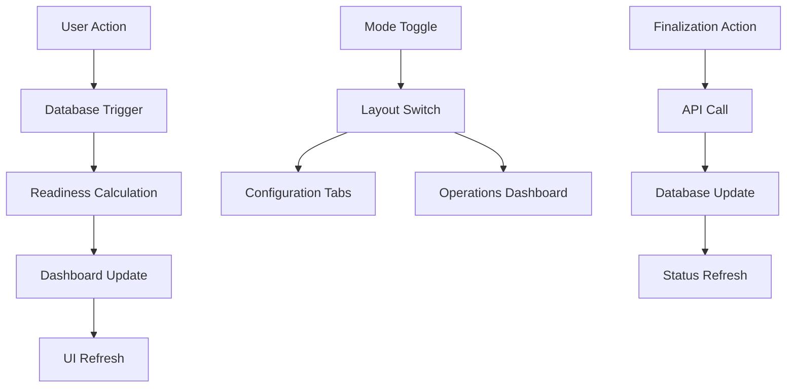

# Project Readiness System - Design Document

## Overview

The Project Readiness System replaces the rigid prep/active checklist with a flexible finalization-based approach. Users can access all features immediately when minimum requirements are met, while receiving intelligent guidance on improving their project setup.

## Architecture

### System Components

1. **Project Readiness Tracking**: Database-driven status tracking with real-time updates
2. **Mode Toggle System**: User-controlled switching between Configuration and Operations views
3. **Intelligent Dashboard**: Prioritized to-do list with actionable guidance
4. **Feature Availability Engine**: Dynamic feature enablement based on minimum requirements
5. **Finalization Workflow**: Admin-controlled completion marking for project areas

### Data Flow



## Database Design

### Project Readiness Table

```sql
CREATE TABLE project_readiness (
  project_id UUID PRIMARY KEY REFERENCES projects(id) ON DELETE CASCADE,
  
  -- Locations
  has_default_locations BOOLEAN DEFAULT TRUE,
  custom_location_count INTEGER DEFAULT 0,
  locations_finalized BOOLEAN DEFAULT FALSE,
  locations_finalized_at TIMESTAMP WITH TIME ZONE,
  locations_finalized_by UUID REFERENCES profiles(id),
  locations_status VARCHAR(20) DEFAULT 'default-only',
  
  -- Roles
  has_default_roles BOOLEAN DEFAULT TRUE,
  custom_role_count INTEGER DEFAULT 0,
  roles_finalized BOOLEAN DEFAULT FALSE,
  roles_finalized_at TIMESTAMP WITH TIME ZONE,
  roles_finalized_by UUID REFERENCES profiles(id),
  roles_status VARCHAR(20) DEFAULT 'default-only',
  
  -- Team
  total_staff_assigned INTEGER DEFAULT 0,
  supervisor_count INTEGER DEFAULT 0,
  escort_count INTEGER DEFAULT 0,
  coordinator_count INTEGER DEFAULT 0,
  team_finalized BOOLEAN DEFAULT FALSE,
  team_finalized_at TIMESTAMP WITH TIME ZONE,
  team_finalized_by UUID REFERENCES profiles(id),
  team_status VARCHAR(20) DEFAULT 'none',
  
  -- Talent
  total_talent INTEGER DEFAULT 0,
  talent_finalized BOOLEAN DEFAULT FALSE,
  talent_finalized_at TIMESTAMP WITH TIME ZONE,
  talent_finalized_by UUID REFERENCES profiles(id),
  talent_status VARCHAR(20) DEFAULT 'none',
  
  -- Assignment Progress
  assignments_status VARCHAR(20) DEFAULT 'none',
  urgent_assignment_issues INTEGER DEFAULT 0,
  
  -- Overall
  overall_status VARCHAR(20) DEFAULT 'getting-started',
  last_updated TIMESTAMP WITH TIME ZONE DEFAULT NOW()
);
```

### Status Enumerations

```sql
-- Locations and Roles
CHECK (locations_status IN ('default-only', 'configured', 'finalized'))
CHECK (roles_status IN ('default-only', 'configured', 'finalized'))

-- Team and Talent
CHECK (team_status IN ('none', 'partial', 'finalized'))
CHECK (talent_status IN ('none', 'partial', 'finalized'))

-- Assignments
CHECK (assignments_status IN ('none', 'partial', 'current', 'complete'))

-- Overall
CHECK (overall_status IN ('getting-started', 'operational', 'production-ready'))
```

## Component Architecture

### Mode Toggle System

**Header Layout:**
```
┌─ Project Header ────────────────────────────────────────────┐
│ [Back] Project Name [Config|Ops] Status Badge      [Edit]  │
└─────────────────────────────────────────────────────────────┘
```

**Mode Toggle Component:**
```typescript
interface ModeToggleProps {
  currentMode: 'configuration' | 'operations';
  onModeChange: (mode: 'configuration' | 'operations') => void;
}

export function ModeToggle({ currentMode, onModeChange }: ModeToggleProps) {
  return (
    <div className="inline-flex rounded-lg border border-border p-1 bg-muted">
      <Button
        variant={currentMode === 'configuration' ? 'default' : 'ghost'}
        size="sm"
        onClick={() => onModeChange('configuration')}
      >
        <Settings className="h-4 w-4 mr-2" />
        Configuration
      </Button>
      <Button
        variant={currentMode === 'operations' ? 'default' : 'ghost'}
        size="sm"
        onClick={() => onModeChange('operations')}
      >
        <Activity className="h-4 w-4 mr-2" />
        Operations
      </Button>
    </div>
  )
}
```

### Dashboard Component

**Info Tab Dashboard:**
```typescript
interface ProjectDashboard {
  overallStatus: 'getting-started' | 'operational' | 'production-ready';
  todoItems: TodoItem[];
  completedItems: CompletedItem[];
  assignmentProgress: AssignmentProgress;
}

interface TodoItem {
  id: string;
  area: 'locations' | 'roles' | 'team' | 'talent' | 'assignments';
  priority: 'critical' | 'important' | 'optional';
  title: string;
  description: string;
  actionText: string;
  actionRoute: string;
}
```

**Visual Hierarchy:**
```
┌─ Project Status ────────────────────────────────┐
│ 🟡 Operational - Ready for limited operations   │
└─────────────────────────────────────────────────┘

┌─ To-Do List ────────────────────────────────────┐
│ Critical:                                       │
│ ❌ Finalize team assignments                    │
│    8 staff assigned but not confirmed ready    │
│    [Go to Roles & Team]                        │
│                                                 │
│ Important:                                      │
│ ⚠️  Complete tomorrow's escort assignments      │
│    3 of 15 talent still need escorts           │
│    [Go to Assignments]                         │
│                                                 │
│ Optional:                                       │
│ 💡 Add custom locations                         │
│    Consider adding Wardrobe, Makeup areas      │
│    [Go to Info Tab]                            │
└─────────────────────────────────────────────────┘

┌─ Completed Setup ───────────────────────────────┐
│ ✅ Role templates configured                    │
│ ✅ Default locations ready                      │
│ ✅ Time tracking available                      │
└─────────────────────────────────────────────────┘
```

### Feature Availability Engine

```typescript
interface FeatureAvailability {
  timeTracking: {
    available: boolean;
    requirement: string;
    guidance?: string;
  };
  assignments: {
    available: boolean;
    requirement: string;
    guidance?: string;
  };
  locationTracking: {
    available: boolean;
    requirement: string;
    guidance?: string;
  };
  supervisorCheckout: {
    available: boolean;
    requirement: string;
    guidance?: string;
  };
}

function calculateFeatureAvailability(readiness: ProjectReadiness): FeatureAvailability {
  return {
    timeTracking: {
      available: readiness.total_staff_assigned > 0,
      requirement: 'At least one staff member assigned',
      guidance: readiness.total_staff_assigned === 0 
        ? 'Assign team members to enable time tracking' 
        : undefined
    },
    assignments: {
      available: readiness.total_talent > 0 && readiness.escort_count > 0,
      requirement: 'Both talent and escorts assigned',
      guidance: readiness.total_talent === 0 
        ? 'Add talent to enable assignments'
        : readiness.escort_count === 0 
        ? 'Assign escorts to enable assignments'
        : undefined
    },
    locationTracking: {
      available: readiness.locations_status !== 'default-only' && readiness.assignments_status !== 'none',
      requirement: 'Custom locations and assignments configured',
      guidance: readiness.locations_status === 'default-only'
        ? 'Add custom locations to enable tracking'
        : 'Make escort assignments to enable location tracking'
    },
    supervisorCheckout: {
      available: readiness.supervisor_count > 0 && readiness.escort_count > 0,
      requirement: 'Supervisor and escorts assigned',
      guidance: readiness.supervisor_count === 0
        ? 'Assign a supervisor to enable checkout controls'
        : undefined
    }
  }
}
```

## API Design

### Readiness Endpoints

**GET /api/projects/[id]/readiness**
```typescript
interface ReadinessResponse {
  project_id: string;
  locations_status: 'default-only' | 'configured' | 'finalized';
  roles_status: 'default-only' | 'configured' | 'finalized';
  team_status: 'none' | 'partial' | 'finalized';
  talent_status: 'none' | 'partial' | 'finalized';
  assignments_status: 'none' | 'partial' | 'current' | 'complete';
  overall_status: 'getting-started' | 'operational' | 'production-ready';
  total_staff_assigned: number;
  total_talent: number;
  urgent_assignment_issues: number;
  todoItems: TodoItem[];
  assignmentProgress: AssignmentProgress;
  featureAvailability: FeatureAvailability;
}
```

**POST /api/projects/[id]/readiness/finalize**
```typescript
interface FinalizeRequest {
  area: 'locations' | 'roles' | 'team' | 'talent';
}

interface FinalizeResponse {
  success: boolean;
  area: string;
  finalizedAt: string;
  finalizedBy: string;
}
```

### Real-Time Updates

**Database Triggers:**
- Automatically recalculate readiness when locations, roles, team assignments, or talent change
- Update `last_updated` timestamp for cache invalidation
- Maintain data consistency across all related tables

**Frontend Subscriptions:**
- Subscribe to project readiness changes via Supabase Realtime
- Update dashboard and overview card when data changes
- Sync mode preferences across browser tabs

## UI/UX Design Patterns

### Status Indicators

**Color Coding:**
- 🔴 **Red (Critical)**: Blocks core functionality, needs immediate attention
- 🟡 **Yellow (Important)**: Partially configured, should be finalized
- 🔵 **Blue (Optional)**: Suggestions for improvement
- 🟢 **Green (Complete)**: Finalized and ready

**Icon System:**
- ❌ **X Circle**: Critical issues requiring action
- ⚠️ **Alert Circle**: Important items needing attention
- 💡 **Lightbulb**: Optional suggestions
- ✅ **Check Circle**: Completed items

### Navigation Patterns

**Tab Navigation:**
- All guidance buttons navigate to specific tabs with clear context
- URL state management preserves mode and tab selections
- Breadcrumb-style navigation shows current location

**Mode Persistence:**
- Remember user's preferred mode per project
- Sync preferences across browser sessions
- Default modes based on user context

### Responsive Design

**Mobile Optimization:**
- Mode toggle adapts to smaller screens
- Dashboard sections stack vertically
- Touch-friendly finalization buttons

**Desktop Enhancement:**
- Side-by-side dashboard and content layout
- Keyboard shortcuts for mode switching
- Hover states for interactive elements

## Performance Considerations

### Database Optimization

**Indexing Strategy:**
```sql
CREATE INDEX idx_project_readiness_overall_status ON project_readiness(overall_status);
CREATE INDEX idx_project_readiness_last_updated ON project_readiness(last_updated);
CREATE INDEX idx_project_readiness_urgent_issues ON project_readiness(urgent_assignment_issues);
```

**Query Optimization:**
- Single query to fetch all readiness data
- Calculated fields for complex metrics
- Efficient trigger functions for updates

### Frontend Performance

**Caching Strategy:**
- Cache readiness data with short TTL (30 seconds)
- Optimistic updates for immediate feedback
- Background refresh for data consistency

**Bundle Optimization:**
- Lazy load dashboard components
- Code splitting for mode-specific features
- Minimize re-renders with React.memo

## Security Considerations

### Access Control

**Finalization Permissions:**
- Only admin and in_house users can finalize areas
- Audit trail for all finalization actions
- Immutable finalization timestamps

**Data Protection:**
- Row-level security for project readiness data
- Input validation for all API endpoints
- CSRF protection for finalization actions

### Data Integrity

**Consistency Guarantees:**
- Database triggers ensure metric accuracy
- Atomic operations for finalization
- Rollback capabilities for failed updates

**Audit Requirements:**
- Track who finalized what and when
- Log all readiness status changes
- Maintain history for compliance

This design provides a flexible, user-friendly system that guides users toward operational readiness while never blocking access to available features.