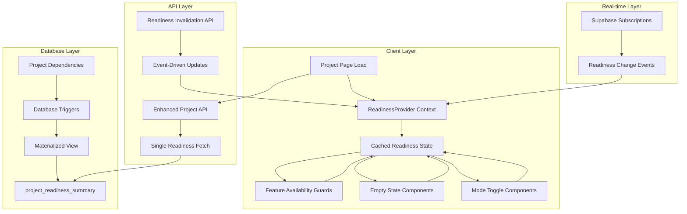

# Design Document

## Overview

This design optimizes the project readiness system by implementing a hybrid client-server architecture that maintains all current UX benefits while dramatically reducing API overhead. The solution combines database-level performance optimizations, intelligent client-side caching, event-driven invalidation, and real-time synchronization to create a responsive and efficient system.

## Architecture

### High-Level Architecture



### Data Flow Architecture

1. **Initial Load**: Single API call fetches project data with embedded readiness information
2. **Client Caching**: Readiness state stored in React Context for immediate access
3. **Optimistic Updates**: UI updates immediately, background sync with server
4. **Real-time Sync**: Supabase subscriptions for multi-user coordination
5. **Event-driven Invalidation**: Smart cache invalidation based on user actions

## Components and Interfaces

### Database Layer

#### Materialized View: project_readiness_summary
```sql
CREATE MATERIALIZED VIEW project_readiness_summary AS
SELECT 
  p.id as project_id,
  p.name,
  p.status,
  -- Overall readiness status
  CASE 
    WHEN p.status = 'active' THEN 'active'
    WHEN (
      COUNT(DISTINCT prt.id) > 0 AND 
      COUNT(DISTINCT ta.id) > 0 AND 
      COUNT(DISTINCT pl.id) > 0
    ) THEN 'ready_for_activation'
    ELSE 'setup_required'
  END as readiness_status,
  
  -- Feature availability flags
  COUNT(DISTINCT prt.id) > 0 as has_role_templates,
  COUNT(DISTINCT ta.id) > 0 as has_team_assignments,
  COUNT(DISTINCT pl.id) > 0 as has_locations,
  COUNT(DISTINCT tr.id) > 0 as has_talent_roster,
  
  -- Blocking issues array
  ARRAY_REMOVE(ARRAY[
    CASE WHEN COUNT(DISTINCT prt.id) = 0 THEN 'missing_role_templates' END,
    CASE WHEN COUNT(DISTINCT ta.id) = 0 THEN 'missing_team_assignments' END,
    CASE WHEN COUNT(DISTINCT pl.id) = 0 THEN 'missing_locations' END
  ], NULL) as blocking_issues,
  
  -- Available features array
  ARRAY_REMOVE(ARRAY[
    CASE WHEN COUNT(DISTINCT prt.id) > 0 THEN 'team_management' END,
    CASE WHEN COUNT(DISTINCT pl.id) > 0 AND p.status = 'active' THEN 'talent_tracking' END,
    CASE WHEN COUNT(DISTINCT ta.id) > 0 AND COUNT(DISTINCT prt.id) > 0 THEN 'scheduling' END,
    CASE WHEN p.status = 'active' THEN 'time_tracking' END
  ], NULL) as available_features,
  
  -- Metadata
  NOW() as calculated_at
FROM projects p
LEFT JOIN project_role_templates prt ON p.id = prt.project_id AND prt.deleted_at IS NULL
LEFT JOIN team_assignments ta ON p.id = ta.project_id AND ta.deleted_at IS NULL
LEFT JOIN project_locations pl ON p.id = pl.project_id AND pl.deleted_at IS NULL
LEFT JOIN talent_roster tr ON p.id = tr.project_id AND tr.deleted_at IS NULL
GROUP BY p.id, p.name, p.status;
```

#### Automatic Refresh Triggers
```sql
-- Function to refresh materialized view
CREATE OR REPLACE FUNCTION refresh_project_readiness()
RETURNS TRIGGER AS $$
BEGIN
  REFRESH MATERIALIZED VIEW CONCURRENTLY project_readiness_summary;
  
  -- Notify real-time subscribers
  PERFORM pg_notify(
    'project_readiness_changed',
    json_build_object(
      'project_id', COALESCE(NEW.project_id, OLD.project_id),
      'action', TG_OP,
      'table', TG_TABLE_NAME
    )::text
  );
  
  RETURN COALESCE(NEW, OLD);
END;
$$ LANGUAGE plpgsql;

-- Triggers on dependency tables
CREATE TRIGGER project_role_templates_readiness_trigger
  AFTER INSERT OR UPDATE OR DELETE ON project_role_templates
  FOR EACH ROW EXECUTE FUNCTION refresh_project_readiness();

CREATE TRIGGER team_assignments_readiness_trigger
  AFTER INSERT OR UPDATE OR DELETE ON team_assignments
  FOR EACH ROW EXECUTE FUNCTION refresh_project_readiness();

CREATE TRIGGER project_locations_readiness_trigger
  AFTER INSERT OR UPDATE OR DELETE ON project_locations
  FOR EACH ROW EXECUTE FUNCTION refresh_project_readiness();
```

### API Layer

#### Enhanced Project API Response
```typescript
// GET /api/projects/[id]
interface ProjectWithReadiness {
  // Existing project fields
  id: string;
  name: string;
  status: 'prep' | 'active' | 'archived';
  created_at: string;
  updated_at: string;
  
  // Embedded readiness data
  readiness: {
    status: 'setup_required' | 'ready_for_activation' | 'active';
    features: {
      team_management: boolean;
      talent_tracking: boolean;
      scheduling: boolean;
      time_tracking: boolean;
    };
    blocking_issues: string[];
    calculated_at: string;
  };
  
  // Related data for initial load
  role_templates: ProjectRoleTemplate[];
  team_assignments: TeamAssignment[];
  locations: ProjectLocation[];
}
```

#### Readiness Invalidation API
```typescript
// POST /api/projects/[id]/readiness/invalidate
interface ReadinessInvalidationRequest {
  reason: 'role_template_change' | 'team_assignment_change' | 'location_change' | 'status_change';
  optimistic_state?: Partial<ProjectReadiness>;
}

interface ReadinessInvalidationResponse {
  readiness: ProjectReadiness;
  timestamp: string;
}
```

### Client Layer

#### ReadinessProvider Context
```typescript
interface ReadinessContextValue {
  // Current readiness state
  readiness: ProjectReadiness | null;
  isLoading: boolean;
  error: Error | null;
  
  // Feature availability helpers
  canAccessFeature: (feature: FeatureName) => boolean;
  getBlockingIssues: () => string[];
  isReady: () => boolean;
  
  // State management
  updateReadiness: (updates: Partial<ProjectReadiness>) => void;
  invalidateReadiness: (reason: string) => Promise<void>;
  refreshReadiness: () => Promise<void>;
}

const ReadinessProvider: React.FC<{
  projectId: string;
  initialReadiness?: ProjectReadiness;
  children: React.ReactNode;
}> = ({ projectId, initialReadiness, children }) => {
  const [readiness, setReadiness] = useState(initialReadiness);
  const [isLoading, setIsLoading] = useState(!initialReadiness);
  const [error, setError] = useState<Error | null>(null);
  
  // Real-time subscription for multi-user updates
  useEffect(() => {
    const subscription = supabase
      .channel(`project-readiness-${projectId}`)
      .on('postgres_changes', {
        event: '*',
        schema: 'public',
        table: 'project_readiness_summary',
        filter: `project_id=eq.${projectId}`
      }, handleReadinessUpdate)
      .subscribe();
      
    return () => subscription.unsubscribe();
  }, [projectId]);
  
  // Optimistic update with background sync
  const updateReadiness = useCallback((updates: Partial<ProjectReadiness>) => {
    setReadiness(current => current ? { ...current, ...updates } : null);
    
    // Background sync
    debouncedSync();
  }, []);
  
  return (
    <ReadinessContext.Provider value={contextValue}>
      {children}
    </ReadinessContext.Provider>
  );
};
```

#### Feature Availability Hook
```typescript
const useFeatureAvailability = () => {
  const { readiness, canAccessFeature, getBlockingIssues } = useContext(ReadinessContext);
  
  return {
    // Feature checks
    canManageTeam: canAccessFeature('team_management'),
    canTrackTalent: canAccessFeature('talent_tracking'),
    canSchedule: canAccessFeature('scheduling'),
    canTrackTime: canAccessFeature('time_tracking'),
    
    // Status checks
    isSetupComplete: readiness?.status !== 'setup_required',
    isReadyForActivation: readiness?.status === 'ready_for_activation',
    isActive: readiness?.status === 'active',
    
    // Guidance
    blockingIssues: getBlockingIssues(),
    nextSteps: getNextSteps(readiness),
  };
};
```

#### Optimized Feature Guard Component
```typescript
const FeatureAvailabilityGuard: React.FC<{
  feature: FeatureName;
  fallback?: React.ReactNode;
  children: React.ReactNode;
}> = ({ feature, fallback, children }) => {
  const { canAccessFeature } = useFeatureAvailability();
  
  if (!canAccessFeature(feature)) {
    return fallback || <EmptyStateGuidance feature={feature} />;
  }
  
  return <>{children}</>;
};
```

## Data Models

### ProjectReadiness Interface
```typescript
interface ProjectReadiness {
  project_id: string;
  status: 'setup_required' | 'ready_for_activation' | 'active';
  features: {
    team_management: boolean;
    talent_tracking: boolean;
    scheduling: boolean;
    time_tracking: boolean;
  };
  blocking_issues: string[];
  calculated_at: string;
}
```

### Feature Configuration
```typescript
const FEATURE_REQUIREMENTS: Record<FeatureName, (readiness: ProjectReadiness) => boolean> = {
  team_management: (r) => r.features.team_management,
  talent_tracking: (r) => r.features.talent_tracking,
  scheduling: (r) => r.features.scheduling,
  time_tracking: (r) => r.features.time_tracking,
};

const BLOCKING_ISSUE_MESSAGES: Record<string, string> = {
  missing_role_templates: 'Add role templates to enable team management',
  missing_team_assignments: 'Assign team members to enable scheduling',
  missing_locations: 'Set up locations to enable talent tracking',
};
```

## Error Handling

### Client-Side Error Recovery
```typescript
const useReadinessErrorRecovery = () => {
  const { error, refreshReadiness } = useContext(ReadinessContext);
  
  useEffect(() => {
    if (error) {
      // Exponential backoff retry
      const retryTimeout = setTimeout(() => {
        refreshReadiness();
      }, Math.min(1000 * Math.pow(2, retryCount), 30000));
      
      return () => clearTimeout(retryTimeout);
    }
  }, [error]);
};
```

### Optimistic Update Conflict Resolution
```typescript
const resolveOptimisticConflict = (
  optimisticState: ProjectReadiness,
  serverState: ProjectReadiness
): ProjectReadiness => {
  // Server state wins for calculated fields
  return {
    ...optimisticState,
    status: serverState.status,
    features: serverState.features,
    blocking_issues: serverState.blocking_issues,
    calculated_at: serverState.calculated_at,
  };
};
```

## Testing Strategy

### Unit Testing
- Test readiness calculation logic in isolation
- Test feature availability rules
- Test optimistic update and conflict resolution
- Test error recovery mechanisms

### Integration Testing
- Test database triggers and materialized view updates
- Test API endpoints with various project states
- Test real-time subscription handling
- Test client-server synchronization

### Performance Testing
- Measure API call reduction (target: 90% reduction)
- Test materialized view refresh performance
- Test client-side cache performance
- Test real-time update latency

### End-to-End Testing
- Test complete user workflows with readiness checks
- Test multi-user scenarios with concurrent updates
- Test offline/online scenarios
- Test error recovery and fallback behaviors

## Migration Strategy

### Phase 1: Database Optimization
1. Create materialized view and triggers
2. Migrate existing readiness calculation logic
3. Test database performance improvements

### Phase 2: API Enhancement
1. Enhance project API to include readiness data
2. Create readiness invalidation endpoints
3. Test API response times and accuracy

### Phase 3: Client Implementation
1. Implement ReadinessProvider context
2. Replace existing readiness hooks
3. Update all components to use new system

### Phase 4: Real-time Integration
1. Add Supabase subscriptions
2. Implement optimistic updates
3. Test multi-user synchronization

### Phase 5: Cleanup and Optimization
1. Remove old readiness API endpoints
2. Clean up unused client-side code
3. Performance monitoring and tuning