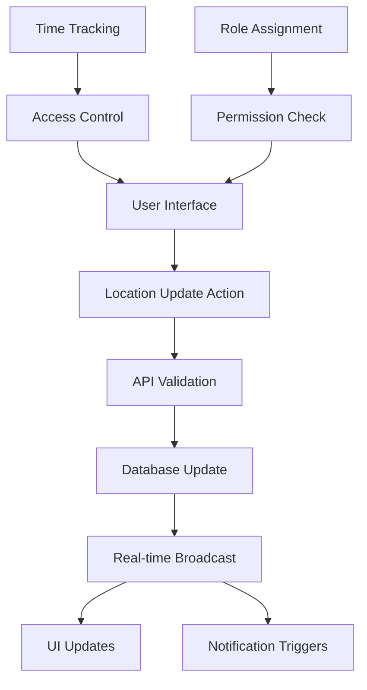

# Design Document

## Overview

The Talent Location Tracking system is a comprehensive feature that enables real-time tracking and management of talent locations within active projects. The system integrates seamlessly with the existing time tracking infrastructure and provides role-based access controls to ensure proper operational security. The design follows the established patterns in the codebase while introducing new components specifically for location management.

## Architecture

### System Integration Points

The talent location tracking system integrates with several existing systems:

1. **Authentication & Authorization**: Uses the existing `AuthContext` and role-based access controls
2. **Time Tracking**: Integrates with the existing `TimeTrackingActionBar` component and `useTimeTracking` hook
3. **Project Management**: Leverages existing project data structures and team assignments
4. **Navigation**: Updates the existing navigation system to support operational vs. database views
5. **Real-time Updates**: Uses Supabase Realtime for live location synchronization
6. **Notification System**: Extends the existing notification infrastructure

### Data Flow Architecture



### Database Schema Extensions

The system leverages existing tables with minimal additions:

- **talent_status**: Existing table for current location tracking
- **project_locations**: Existing table for project-defined locations
- **user_favorites**: Existing table for notification preferences
- **team_assignments**: Enhanced to support floater designation
- **notifications**: Extended for location change notifications

## Components and Interfaces

### Core Components

#### 1. TalentDetailPage Component
**Location**: `app/(app)/talent/[id]/page.tsx`

A comprehensive talent detail page that serves as the primary interface for location tracking.

```typescript
interface TalentDetailPageProps {
  params: { id: string }
  searchParams: { project?: string }
}

interface TalentDetailPageState {
  talent: TalentProfile
  currentStatus: TalentStatus | null
  projectLocations: ProjectLocation[]
  canUpdateLocation: boolean
  isCheckedIn: boolean
  representativeVisible: boolean
}
```

**Key Features**:
- Talent name and photo display
- Integrated time tracking action bar
- Location update controls
- Representative contact section (role-based visibility)
- Contact escort button (conditionally shown)

#### 2. LocationUpdateControls Component
**Location**: `components/talent/location-update-controls.tsx`

Handles the location update interface with touch-friendly buttons.

```typescript
interface LocationUpdateControlsProps {
  talentId: string
  projectId: string
  currentLocation: ProjectLocation | null
  availableLocations: ProjectLocation[]
  onLocationUpdate: (locationId: string) => Promise<void>
  disabled: boolean
}
```

**Design Considerations**:
- Grid layout for location buttons with adequate touch targets (minimum 44px)
- Color-coded location buttons matching project location colors
- Loading states during updates
- Error handling with retry capability
- Optimistic UI updates with rollback on failure

#### 3. TalentLocationTracker Component (Enhanced)
**Location**: `components/talent/talent-location-tracker.tsx`

Enhanced version of the existing component with improved real-time capabilities.

```typescript
interface TalentLocationTrackerProps {
  talentId: string
  projectId: string
  currentStatus?: TalentStatus
  onLocationUpdate: () => void
  showHistory?: boolean
  compact?: boolean
}
```

#### 4. FloaterAssignmentManager Component
**Location**: `components/projects/floater-assignment-manager.tsx`

Manages the designation of escorts as floaters within team assignments.

```typescript
interface FloaterAssignmentManagerProps {
  projectId: string
  teamAssignments: TeamAssignment[]
  onAssignmentUpdate: (assignmentId: string, isFloater: boolean) => void
}
```

### Enhanced Components

#### 1. Navigation System Updates
**Location**: `lib/navigation-config.ts`

Updated navigation configuration to support operational vs. database views:

```typescript
// New navigation items for operational users
const operationalNavItems: NavItem[] = [
  {
    id: 'talent',
    label: 'Talent',
    href: '/talent',
    icon: StarIcon,
    roles: ['supervisor', 'coordinator', 'talent_escort']
  },
  {
    id: 'team',
    label: 'Team', 
    href: '/team',
    icon: UsersIcon,
    roles: ['supervisor', 'coordinator']
  }
]

// Updated navigation items for admin users
const adminNavItems: NavItem[] = [
  {
    id: 'talent-database',
    label: 'Talent Database',
    href: '/talent-database',
    icon: StarIcon,
    roles: ['admin', 'in_house']
  },
  {
    id: 'team-database',
    label: 'Team Database',
    href: '/team-database', 
    icon: UsersIcon,
    roles: ['admin', 'in_house']
  }
]
```

#### 2. TimeTrackingActionBar Integration
**Location**: `components/timecards/time-tracking-action-bar.tsx`

Enhanced to work seamlessly within talent detail pages:

```typescript
interface EnhancedTimeTrackingActionBarProps extends TimeTrackingActionBarProps {
  context: 'talent-detail' | 'general'
  onAccessChange?: (hasAccess: boolean) => void
}
```

### API Endpoints

#### 1. Talent Location Update API
**Location**: `app/api/projects/[id]/talent/[talentId]/location/route.ts`

```typescript
// POST /api/projects/[id]/talent/[talentId]/location
interface LocationUpdateRequest {
  locationId: string
  notes?: string
}

interface LocationUpdateResponse {
  success: boolean
  status: TalentStatus
  timestamp: string
}
```

#### 2. Floater Assignment API
**Location**: `app/api/projects/[id]/team-assignments/[assignmentId]/floater/route.ts`

```typescript
// PUT /api/projects/[id]/team-assignments/[assignmentId]/floater
interface FloaterAssignmentRequest {
  isFloater: boolean
}

interface FloaterAssignmentResponse {
  success: boolean
  assignment: TeamAssignment
}
```

#### 3. Real-time Location Updates API
**Location**: `app/api/projects/[id]/talent/location-updates/route.ts`

```typescript
// GET /api/projects/[id]/talent/location-updates (Server-Sent Events)
interface LocationUpdateEvent {
  type: 'location_change'
  talentId: string
  newLocation: ProjectLocation
  updatedBy: string
  timestamp: string
}
```

## Data Models

### Enhanced Team Assignment Model

```typescript
interface EnhancedTeamAssignment extends TeamAssignment {
  is_floater: boolean
  floater_designated_at?: string
  floater_designated_by?: string
}
```

### Talent Access Control Model

```typescript
interface TalentAccessControl {
  userId: string
  projectId: string
  accessibleTalentIds: string[]
  isFloater: boolean
  isCheckedIn: boolean
  canUpdateLocations: boolean
}
```

### Location Update Event Model

```typescript
interface LocationUpdateEvent {
  id: string
  talentId: string
  projectId: string
  fromLocationId?: string
  toLocationId: string
  updatedBy: string
  timestamp: string
  notes?: string
  // Real-time broadcast data
  talentName: string
  locationName: string
  updatedByName: string
}
```

## Error Handling

### Client-Side Error Handling

1. **Network Errors**: Retry mechanism with exponential backoff
2. **Permission Errors**: Clear messaging with role-based explanations
3. **Validation Errors**: Field-level error display with correction guidance
4. **Real-time Connection Errors**: Graceful degradation with manual refresh option

### Server-Side Error Handling

1. **Authentication Errors**: Proper HTTP status codes with secure error messages
2. **Authorization Errors**: Role-based error responses
3. **Database Errors**: Transaction rollback with consistent state
4. **Rate Limiting**: Prevent abuse of location update endpoints

### Error Recovery Patterns

```typescript
interface ErrorRecoveryStrategy {
  retryable: boolean
  maxRetries: number
  backoffStrategy: 'linear' | 'exponential'
  fallbackAction?: () => void
  userMessage: string
}
```

## Testing Strategy

### Unit Testing

1. **Component Testing**: React Testing Library for all new components
2. **Hook Testing**: Custom hooks with mock data and state transitions
3. **Utility Testing**: Location update logic and permission calculations
4. **API Testing**: Endpoint validation and error handling

### Integration Testing

1. **Real-time Updates**: WebSocket connection and event handling
2. **Permission Flow**: Role-based access control across components
3. **Time Tracking Integration**: Check-in/out status affecting location access
4. **Database Transactions**: Location updates with audit trail creation

### End-to-End Testing

1. **User Workflows**: Complete location tracking scenarios by role
2. **Multi-user Scenarios**: Concurrent location updates and conflict resolution
3. **Mobile Responsiveness**: Touch interactions and responsive layouts
4. **Notification Flow**: Location change notifications across user types

### Performance Testing

1. **Real-time Scalability**: Multiple concurrent users updating locations
2. **Database Performance**: Location history queries and indexing
3. **Mobile Performance**: Touch responsiveness and battery usage
4. **Network Efficiency**: Optimized payload sizes for mobile connections

## Security Considerations

### Access Control

1. **Role-Based Permissions**: Strict enforcement at API and UI levels
2. **Project-Based Isolation**: Users can only access assigned projects
3. **Talent Assignment Validation**: Escorts can only update assigned talent
4. **Floater Designation Security**: Only authorized users can designate floaters

### Data Protection

1. **Audit Logging**: Complete trail of all location changes
2. **Input Validation**: Sanitization of all user inputs
3. **Rate Limiting**: Prevent abuse of location update endpoints
4. **Secure Real-time**: Authenticated WebSocket connections only

### Privacy Considerations

1. **Representative Contact Visibility**: Role-based access to sensitive information
2. **Location History**: Appropriate retention and access policies
3. **Notification Privacy**: Users only receive notifications for authorized talent
4. **Data Minimization**: Only necessary location data is stored and transmitted

## Performance Optimization

### Real-time Performance

1. **Connection Pooling**: Efficient WebSocket connection management
2. **Event Batching**: Group multiple location updates for efficiency
3. **Selective Updates**: Only broadcast to users with relevant access
4. **Connection Recovery**: Automatic reconnection with state synchronization

### Mobile Optimization

1. **Touch Targets**: Minimum 44px touch targets for all interactive elements
2. **Gesture Support**: Swipe and tap optimizations for mobile devices
3. **Offline Capability**: Queue location updates when offline
4. **Battery Efficiency**: Optimized real-time connection management

### Database Optimization

1. **Indexing Strategy**: Optimized indexes for location queries
2. **Query Optimization**: Efficient joins for talent and location data
3. **Caching Strategy**: Redis caching for frequently accessed data
4. **Connection Pooling**: Efficient database connection management

## Accessibility

### WCAG 2.1 AA Compliance

1. **Keyboard Navigation**: Full keyboard accessibility for all interactions
2. **Screen Reader Support**: Proper ARIA labels and semantic HTML
3. **Color Contrast**: Sufficient contrast ratios for all UI elements
4. **Focus Management**: Clear focus indicators and logical tab order

### Mobile Accessibility

1. **Touch Accessibility**: Adequate touch targets and gesture support
2. **Voice Control**: Compatibility with mobile voice control features
3. **High Contrast Mode**: Support for system-level accessibility settings
4. **Text Scaling**: Responsive to system font size preferences

## Deployment Considerations

### Feature Flags

1. **Gradual Rollout**: Feature flags for controlled deployment
2. **Role-Based Rollout**: Enable features by user role first
3. **Project-Based Rollout**: Enable for specific projects initially
4. **Rollback Capability**: Quick disable if issues are discovered

### Migration Strategy

1. **Database Migrations**: Safe schema updates with rollback capability
2. **Data Migration**: Existing talent status data preservation
3. **API Versioning**: Backward compatibility during transition
4. **User Training**: Documentation and training materials

### Monitoring and Observability

1. **Real-time Metrics**: WebSocket connection health and performance
2. **Location Update Metrics**: Success rates and error tracking
3. **User Engagement**: Feature usage analytics by role
4. **Performance Monitoring**: Response times and error rates

## Future Enhancements

### Phase 2 Considerations

1. **Bulk Location Updates**: Update multiple talent locations simultaneously
2. **Location Templates**: Predefined location sequences for common workflows
3. **Advanced Notifications**: Customizable notification rules and preferences
4. **Location Analytics**: Reporting on talent movement patterns

### Integration Opportunities

1. **Calendar Integration**: Sync with external scheduling systems
2. **Communication Tools**: Direct integration with messaging platforms
3. **Reporting Systems**: Enhanced reporting with location data
4. **Mobile App**: Native mobile application for enhanced performance