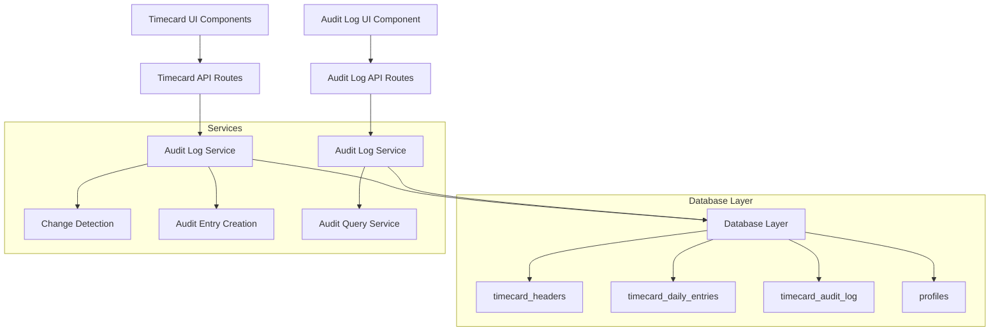

# Timecard Audit Log System Design

## Overview

The timecard audit log system provides comprehensive tracking of all changes made to timecard data throughout the timecard lifecycle. The system captures field-level changes with full context, provides RESTful API access to audit data, and integrates seamlessly into the existing timecard management interface. The design leverages the existing `timecard_audit_log` table and builds upon the current timecard infrastructure.

## Architecture

### High-Level Architecture



### Data Flow

1. **Change Detection**: When timecard data is modified, the system compares old and new values
2. **Audit Entry Creation**: For each changed field, an audit log entry is created with appropriate context
3. **Batch Grouping**: Related changes in a single operation share a common change_id
4. **API Access**: Audit log data is accessible via RESTful endpoints with proper authorization
5. **UI Integration**: Audit trail is displayed in the timecard details interface

## Components and Interfaces

### Database Schema

The existing `timecard_audit_log` table provides the foundation:

```sql
-- Existing table structure (from Prisma schema)
model timecard_audit_log {
  id               String           @id @default(dbgenerated("gen_random_uuid()")) @db.Uuid
  timecard_id      String           @db.Uuid
  change_id        String           @db.Uuid
  field_name       String           @db.VarChar(100)
  old_value        String?
  new_value        String?
  changed_by       String           @db.Uuid
  changed_at       DateTime         @default(now()) @db.Timestamptz(6)
  action_type      String           @db.VarChar(20)
  work_date        DateTime?        @db.Date
  profiles         profiles         @relation(fields: [changed_by], references: [id])
  timecard_headers timecard_headers @relation(fields: [timecard_id], references: [id])
}
```

### Audit Log Service

```typescript
// lib/audit-log-service.ts
export interface AuditLogEntry {
  id: string;
  timecard_id: string;
  change_id: string;
  field_name: string;
  old_value: string | null;
  new_value: string | null;
  changed_by: string;
  changed_at: Date;
  action_type: 'user_edit' | 'admin_edit' | 'rejection_edit';
  work_date: Date | null;
  changed_by_profile?: {
    full_name: string;
  };
}

export interface AuditLogFilter {
  action_type?: string[];
  field_name?: string[];
  date_from?: Date;
  date_to?: Date;
  limit?: number;
  offset?: number;
}

export class AuditLogService {
  // Record changes when timecard data is modified
  async recordChanges(
    timecardId: string,
    changes: FieldChange[],
    changedBy: string,
    actionType: 'user_edit' | 'admin_edit' | 'rejection_edit',
    workDate?: Date
  ): Promise<void>

  // Retrieve audit logs for a timecard
  async getAuditLogs(
    timecardId: string,
    filter?: AuditLogFilter
  ): Promise<AuditLogEntry[]>

  // Get audit logs grouped by change_id
  async getGroupedAuditLogs(
    timecardId: string,
    filter?: AuditLogFilter
  ): Promise<GroupedAuditEntry[]>
}

interface FieldChange {
  fieldName: string;
  oldValue: any;
  newValue: any;
}

interface GroupedAuditEntry {
  change_id: string;
  changed_at: Date;
  changed_by: string;
  action_type: string;
  changes: AuditLogEntry[];
  changed_by_profile?: {
    full_name: string;
  };
}
```

### API Routes

#### GET /api/timecards/[id]/audit-logs

```typescript
// app/api/timecards/[id]/audit-logs/route.ts
export async function GET(
  request: Request,
  { params }: { params: { id: string } }
) {
  // Validate user permissions
  // Parse query parameters for filtering
  // Fetch audit logs using AuditLogService
  // Return paginated results with user profile information
}
```

**Query Parameters:**
- `action_type`: Filter by action type (user_edit, admin_edit, rejection_edit)
- `field_name`: Filter by specific field names
- `date_from`: Filter changes after this date
- `date_to`: Filter changes before this date
- `limit`: Number of results per page (default: 50)
- `offset`: Pagination offset (default: 0)
- `grouped`: Return results grouped by change_id (default: false)

**Response Format:**
```typescript
interface AuditLogResponse {
  data: AuditLogEntry[] | GroupedAuditEntry[];
  pagination: {
    total: number;
    limit: number;
    offset: number;
    has_more: boolean;
  };
}
```

### UI Components

#### AuditTrailSection Component

```typescript
// components/timecards/audit-trail-section.tsx
interface AuditTrailSectionProps {
  timecardId: string;
  className?: string;
}

export function AuditTrailSection({ timecardId, className }: AuditTrailSectionProps) {
  // Fetch audit logs using SWR or React Query
  // Display audit entries with proper styling
  // Handle pagination and filtering
  // Show loading states and error handling
}
```

#### AuditLogEntry Component

```typescript
// components/timecards/audit-log-entry.tsx
interface AuditLogEntryProps {
  entry: AuditLogEntry;
  isGrouped?: boolean;
}

export function AuditLogEntry({ entry, isGrouped }: AuditLogEntryProps) {
  // Display individual audit log entry
  // Format field names and values appropriately
  // Apply action-type specific styling
  // Handle time formatting and user display
}
```

#### GroupedAuditEntry Component

```typescript
// components/timecards/grouped-audit-entry.tsx
interface GroupedAuditEntryProps {
  group: GroupedAuditEntry;
  defaultExpanded?: boolean;
}

export function GroupedAuditEntry({ group, defaultExpanded }: GroupedAuditEntryProps) {
  // Display grouped changes with collapsible interface
  // Show summary of changes in header
  // Expand to show individual field changes
}
```

## Data Models

### Field Name Mapping

The system will track changes to the following timecard fields:

```typescript
const TRACKABLE_FIELDS = {
  // Time tracking fields
  'check_in_time': 'Check In Time',
  'check_out_time': 'Check Out Time',
  'break_start_time': 'Break Start Time',
  'break_end_time': 'Break End Time',
  
  // Calculated fields
  'total_hours': 'Total Hours',
  'break_duration': 'Break Duration',
  'overtime_hours': 'Overtime Hours',
  
  // Status and metadata
  'status': 'Status',
  'manually_edited': 'Manually Edited Flag',
  'admin_notes': 'Admin Notes',
  
  // Daily entry fields (for multi-day timecards)
  'daily_check_in': 'Daily Check In',
  'daily_check_out': 'Daily Check Out',
  'daily_break_start': 'Daily Break Start',
  'daily_break_end': 'Daily Break End',
  'daily_total_hours': 'Daily Total Hours'
} as const;
```

### Value Formatting

```typescript
interface ValueFormatter {
  formatOldValue(fieldName: string, value: any): string;
  formatNewValue(fieldName: string, value: any): string;
  formatTimestamp(date: Date): string;
  formatDuration(minutes: number): string;
}

// Time values: "2024-01-15 09:30 AM"
// Duration values: "8.5 hours" or "30 minutes"
// Status values: "Draft" → "Submitted"
// Boolean values: "Yes" / "No"
// Null values: "(empty)" or "(not set)"
```

## Error Handling

### Audit Log Creation Failures

```typescript
class AuditLogError extends Error {
  constructor(
    message: string,
    public readonly timecardId: string,
    public readonly originalError?: Error
  ) {
    super(message);
    this.name = 'AuditLogError';
  }
}

// Error handling strategy:
// 1. Log audit creation failures to system logs
// 2. Continue with timecard operation (don't block user)
// 3. Attempt retry for transient failures
// 4. Alert administrators for persistent failures
```

### API Error Responses

```typescript
interface AuditLogErrorResponse {
  error: string;
  code: 'UNAUTHORIZED' | 'NOT_FOUND' | 'VALIDATION_ERROR' | 'INTERNAL_ERROR';
  details?: string;
}

// HTTP Status Codes:
// 400: Invalid query parameters or malformed request
// 401: User not authenticated
// 403: User lacks permission to view audit logs
// 404: Timecard not found
// 500: Internal server error during audit log retrieval
```

## Testing Strategy

### Unit Tests

1. **AuditLogService Tests**
   - Test change detection and recording
   - Test query filtering and pagination
   - Test error handling and edge cases

2. **API Route Tests**
   - Test authentication and authorization
   - Test query parameter validation
   - Test response formatting

3. **Component Tests**
   - Test audit trail display with various data states
   - Test filtering and pagination interactions
   - Test accessibility compliance

### Integration Tests

1. **End-to-End Audit Flow**
   - Create timecard → Edit fields → Verify audit logs
   - Test rejection workflow with audit logging
   - Test admin edit workflow with audit logging

2. **Performance Tests**
   - Test audit log queries with large datasets
   - Test concurrent audit log creation
   - Test UI responsiveness with many audit entries

### Test Data Scenarios

```typescript
// Test scenarios to cover:
const TEST_SCENARIOS = [
  'Single field change by user',
  'Multiple field changes in one operation',
  'Admin editing draft timecard',
  'Admin editing during rejection',
  'User editing after rejection',
  'Time field changes with various formats',
  'Status transitions',
  'Null value handling',
  'Large audit log datasets',
  'Concurrent modifications'
];
```

## Performance Considerations

### Database Optimization

1. **Indexing Strategy**
   - Primary indexes on timecard_id, changed_at, change_id (already exist)
   - Composite index on (timecard_id, action_type) for filtered queries
   - Index on changed_by for user-specific queries

2. **Query Optimization**
   - Use pagination for large result sets
   - Implement query result caching for frequently accessed audit logs
   - Use database-level filtering instead of application-level filtering

3. **Data Retention**
   - Implement archival strategy for old audit logs
   - Consider partitioning by date for very large datasets

### Frontend Performance

1. **Data Loading**
   - Implement lazy loading for audit trail section
   - Use virtual scrolling for large audit log lists
   - Cache audit log data with appropriate invalidation

2. **UI Optimization**
   - Implement collapsible sections for grouped entries
   - Use skeleton loading states
   - Debounce filter inputs

## Security Considerations

### Access Control

```typescript
// Permission matrix for audit log access
const AUDIT_LOG_PERMISSIONS = {
  admin: {
    canViewAll: true,
    canExport: true,
    canViewSensitiveFields: true
  },
  in_house: {
    canViewAll: true, // configurable
    canExport: true,
    canViewSensitiveFields: true
  },
  supervisor: {
    canViewOwn: true,
    canExport: false,
    canViewSensitiveFields: false
  },
  coordinator: {
    canViewOwn: true,
    canExport: false,
    canViewSensitiveFields: false
  },
  talent_escort: {
    canViewOwn: true,
    canExport: false,
    canViewSensitiveFields: false
  }
};
```

### Data Protection

1. **Audit Log Immutability**
   - Prevent updates or deletes on audit log entries
   - Use database constraints to enforce immutability
   - Log any attempts to modify audit data

2. **Sensitive Data Handling**
   - Avoid logging sensitive personal information
   - Sanitize field values if necessary
   - Implement field-level access controls

3. **Audit Trail Security**
   - Log access to audit logs themselves
   - Implement rate limiting on audit log API endpoints
   - Monitor for suspicious audit log access patterns

## Integration Points

### Existing Timecard System

1. **Timecard Edit Operations**
   - Integrate audit logging into existing edit APIs
   - Ensure audit logs are created before timecard data is saved
   - Handle transaction rollback if audit logging fails

2. **Rejection Workflow**
   - Modify rejection API to capture field changes
   - Ensure rejection edits are properly classified
   - Maintain existing rejection notification system

3. **User Interface Integration**
   - Add audit trail section to timecard details page
   - Ensure consistent styling with existing timecard UI
   - Maintain responsive design principles

### Future Enhancements

1. **Export Functionality**
   - CSV export of audit logs for external analysis
   - PDF reports for audit compliance
   - Integration with external audit systems

2. **Advanced Analytics**
   - Audit log analytics dashboard
   - Change pattern analysis
   - Automated anomaly detection

3. **Real-time Updates**
   - WebSocket integration for live audit log updates
   - Push notifications for significant changes
   - Real-time collaboration indicators